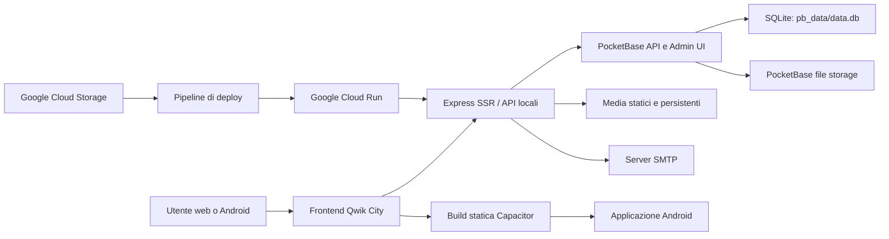

# JudoOK — Report tecnico e funzionale del progetto

**Progetto:** JudoOK / Judo Qwik App

**Repository analizzato:** `judo-qwik`

**Data del report:** 5 agosto 2026

**Dominio di produzione:** <https://judo.1ms.it>
**Stato:** applicazione web in produzione, applicazione Android disponibile, applicazione iOS non ancora implementata

---

## 1. Scopo del documento

Questo documento descrive lo stato reale del progetto JudoOK alla data indicata. Riunisce in un'unica specifica:

- obiettivi e destinatari della piattaforma;
- architettura applicativa e infrastrutturale;
- stack tecnologico e dipendenze principali;
- tutte le funzionalità pubbliche e amministrative rilevate nel codice;
- struttura e consistenza del database PocketBase;
- logica dei quiz e dei giochi didattici;
- gestione dei media, dell'audio e delle email;
- build web, packaging Android e deploy su Google Cloud;
- stato della versione iOS;
- aspetti di sicurezza, limiti tecnici e priorità di evoluzione;
- mappa dei file principali e procedure operative.

L'analisi è stata eseguita direttamente sul codice, sulle configurazioni, sulle migrazioni e sul database locale. I file generati, le cache Android e i contenuti binari sono stati censiti ma non interpretati come codice sorgente.

---

## 2. Sintesi del prodotto

JudoOK è una piattaforma digitale italiana dedicata allo studio del Judo. Combina un portale editoriale, un catalogo tecnico, strumenti per la preparazione agli esami DAN e giochi didattici. Lo stesso frontend viene distribuito come sito web responsive e come applicazione Android tramite Capacitor.

Il prodotto offre quattro aree principali:

1. **Studio:** tecniche, Kata, dizionario, storia, programmi d'esame e contenuti FIJLKAM.
2. **Allenamento:** quiz d'esame, Gokyo Quiz, Gokyo-Tris e flash card.
3. **Informazione:** bacheca, archivio, galleria e contenuti federali.
4. **Gestione:** pannello amministrativo per contenuti, quiz, categorie, media, task e impostazioni.

La sorgente dati principale è PocketBase, con database SQLite e file storage. Qwik City gestisce pagine, routing e rendering; Express fornisce il server di produzione e inoltra le richieste PocketBase. Google Cloud Run ospita il container di produzione.

---

## 3. Dimensioni e stato del repository

Il censimento completo del progetto ha rilevato:

| Ambito | Quantità rilevata |
|---|---:|
| File complessivi nel progetto | 1.748 |
| File sorgente analizzati in `src` | 102 |
| Parole nel codice `src` | circa 66.172 |
| Componenti/simboli nel grafo del codice | 338 |
| Relazioni architetturali rilevate | 579 |
| Comunità/moduli logici rilevati | 24 |
| File in `public/media` | 738 circa, inclusi metadati |
| Dimensione di `public/media` | circa 77 MB |
| Dimensione di `pb_data` | circa 113 MB |
| Dimensione della cartella Android | circa 377 MB, incluse cache e build |

Il repository contiene numerose modifiche locali e file generati. La working tree non è pulita: prima di operazioni Git definitive è necessario separare codice sorgente, artefatti di build, cache e backup.

---

## 4. Architettura generale

### 4.1 Componenti principali

- **Frontend Qwik/Qwik City:** interfaccia, routing, loader dati, stato reattivo e rendering SSR/statico.
- **Server Express:** compressione, CORS, file statici, redirect APK, proxy verso PocketBase e handler Qwik City.
- **PocketBase:** autenticazione, collezioni, API REST, pannello nativo `/_/`, file e database SQLite.
- **Media statici:** asset in `public/media`, inclusi WebP, SVG, JPEG, MP3, MP4 e PDF.
- **Media persistenti:** in produzione il server cerca anche in `/app/pb_data` e `/app/pb_data/media`.
- **Email:** Nodemailer e SMTP per notifiche e promemoria amministrativi.
- **Android:** WebView Capacitor contenente la build statica Qwik e accesso al backend pubblico.
- **Infrastruttura:** Cloud Build, Container Registry/Google Container Registry, Cloud Run e Cloud Storage.

### 4.2 Flusso di una richiesta web

1. Il browser apre `https://judo.1ms.it`.
2. Express serve gli asset statici o passa la richiesta al router Qwik City.
3. Le route pubbliche caricano i dati tramite il client PocketBase.
4. Le richieste `/api/*` PocketBase e `/_/*` vengono inoltrate a PocketBase sulla porta locale `8090`.
5. Le cinque API Qwik locali sono escluse dal proxy e gestite dal server applicativo.
6. Immagini e audio vengono risolti da `dist/media`, poi dalle directory persistenti configurate.

### 4.3 Flusso Android

1. Qwik genera una build statica nella directory `dist`.
2. Gli asset media vengono copiati nel pacchetto.
3. Capacitor sincronizza `dist` nel progetto Android.
4. Gradle genera l'APK.
5. L'app usa sempre `https://judo.1ms.it` per i dati PocketBase dinamici.

L'app Android include molti asset locali, ma non è completamente offline: i contenuti correnti del database e le API richiedono la connettività verso il dominio di produzione.

---

## 5. Stack tecnologico

| Livello | Tecnologia | Versione/configurazione rilevata | Ruolo |
|---|---|---|---|
| UI/runtime | Qwik | 1.18.x | Componenti resumable e stato reattivo |
| Routing | Qwik City | 1.18.x | Route filesystem, loader, endpoint e SSR |
| Build | Vite | 5.4.x | Dev server e bundling |
| Linguaggio | TypeScript | 5.4.5 | Tipizzazione del frontend e server |
| CSS | Tailwind CSS | 4.1.x | Utility CSS e layout responsive |
| Backend dati | PocketBase | server 0.35.0 nel Dockerfile; SDK 0.26.5 | REST, auth, SQLite e file |
| Server web | Express | 5.2.x | SSR, proxy e asset statici |
| Compressione | compression | 1.8.x | Gzip HTTP |
| Proxy | http-proxy-middleware | 3.0.x | Inoltro a PocketBase |
| Editor admin | Quill | 2.0.x | Editing rich text |
| Email | Nodemailer | 7.0.x | Invio SMTP |
| Mobile | Capacitor Core/Android/CLI | 8.0.1 | Contenitore Android |
| Mobile plugin | Capacitor Status Bar | 8.x | Gestione status bar |
| Database locale | SQLite | tramite PocketBase | Persistenza relazionale |
| Cloud | Google Cloud Build e Cloud Run | regione `europe-west1` | Build e hosting |
| Storage | Google Cloud Storage | bucket dati e bucket APK | Sincronizzazione e file grandi |

Nel progetto sono presenti anche `sql.js`, `sqlite` e `sqlite3`, ma l'architettura applicativa corrente usa PocketBase come sorgente dati primaria. I vecchi moduli SQLite diretti sono stati rimossi dal flusso attivo.

### 5.1 PWA

La dipendenza `@qwikdev/pwa` è installata, ma il plugin è commentato in `vite.config.ts`. Non risulta quindi attivo un service worker PWA completo nel sito corrente. La presenza di file `.webmanifest` tra i media non equivale a una PWA installabile configurata a livello applicativo.

---

## 6. Struttura delle directory

| Percorso | Contenuto |
|---|---|
| `src/routes` | Pagine pubbliche, API e pannello amministrativo |
| `src/components` | Componenti condivisi pubblici e admin |
| `src/lib` | Client PocketBase, auth admin, feedback quiz e utility form |
| `src/context` | Stato globale dell'interfaccia |
| `src/utils` | Invio email e utility server |
| `public/media` | Immagini, audio, video e documenti statici |
| `pb_data` | Database, storage e dati PocketBase locali |
| `pb_migrations` | Migrazioni versionate dello schema |
| `android` | Progetto nativo Android Capacitor/Gradle |
| `adapters/express` | Build adapter Node/Express |
| `adapters/static` | Build statica usata anche dall'APK |
| `scripts` | Script di audit e staging APK |
| `reports` | Rapporti tecnici e di integrità precedenti |
| `md` | Documentazione di lavoro e contenuti di verifica |
| `graphify-out` | Grafo tecnico del codice e report delle dipendenze |

---

## 7. Navigazione e shell dell'applicazione

### 7.1 Header e menu principale

Il layout globale offre:

- logo JudoOK;
- interruttore tema chiaro/scuro;
- ricerca globale;
- menu hamburger responsive;
- collegamenti a Home, Tecniche, Kata e Dizionario;
- gruppo “Quiz Test Giochi” con Quiz Esame, Gokyo Quiz, Gokyo-Tris e Flash Card;
- collegamenti a Storia, FIJLKAM e Bacheca & Archivio;
- accesso al download Android;
- pulsante/assistente “Aiuto Kano” durante il quiz.

### 7.2 Navigazione mobile inferiore

Su schermi piccoli è presente una barra fissa con quattro voci:

- **Home**;
- **Studia**;
- **Quiz**;
- **Risorse**.

La voce Quiz include come stato attivo tutte le route di allenamento. L'etichetta precedentemente associata ad “Allenati” è ora “Quiz”. Il layout usa una safe area inferiore per i dispositivi con gesture bar o notch.

### 7.3 Tema

- Modalità chiara e scura.
- Preferenza salvata in `localStorage` con chiave `theme`.
- Rispetto automatico di `prefers-color-scheme` quando non esiste una preferenza.
- Script eseguito nel `<head>` prima del rendering per limitare il lampeggio del tema errato.

### 7.4 Stato globale

`AppContext` mantiene:

- stato del tema;
- apertura menu e ricerca;
- sottomenu espansi;
- titolo e icona della sezione corrente;
- eventuale occultamento della navigazione;
- stato di quiz in corso;
- livello dell'assistente Kano.

---

## 8. Home page

La home è il punto di accesso alle principali esperienze:

- Tecniche;
- I Kata;
- Dizionario;
- Storia del Judo;
- Quiz Esame;
- Gokyo Quiz;
- Gokyo-Tris;
- Flash Cards;
- Bacheca & Archivio;
- FIJLKAM.

Le card non sono rigidamente statiche: l'app memorizza l'utilizzo in `localStorage` con la chiave `judo_card_usage` e può ordinare i percorsi in base alla frequenza d'uso. Il design è responsive, con azioni grandi e contenuti pensati per il tocco.

---

## 9. Ricerca globale

La modale di ricerca interroga più aree del portale e restituisce risultati con collegamento diretto alla sezione pertinente. Le entità ricercabili comprendono tecniche, Kata, dizionario, storia, FIJLKAM, bacheca e galleria.

Caratteristiche principali:

- ricerca trasversale tra più collezioni PocketBase;
- normalizzazione e presentazione omogenea dei risultati;
- deep link tramite query string o ID;
- cache dei risultati in `sessionStorage` per ridurre richieste ripetute;
- modale ottimizzata per desktop e mobile;
- interazione da tastiera nelle parti che la supportano.

Il client pubblico `pb` è uno dei nodi centrali del progetto perché collega quasi tutte le aree informative e didattiche.

---

## 10. Funzionalità di studio

### 10.1 Tecniche

Route: `/tecniche`

La sezione contiene il catalogo tecnico del Judo, ordinato per ordine e titolo. Funzioni rilevate:

- caricamento dalla collezione `tecniche`;
- visualizzazione a griglia o organizzata per gruppi;
- ricerca per nome;
- filtri per gruppo Gokyo, categoria tecnica e livello DAN;
- conteggio dei risultati;
- apertura di una scheda dettagliata a tutto schermo;
- navigazione precedente/successiva tra le tecniche filtrate;
- immagine con più strategie di fallback per nomi e slug;
- titolo italiano/romanizzato e denominazione giapponese/kanji;
- descrizione HTML;
- riproduzione della pronuncia audio;
- video YouTube incorporato quando disponibile;
- ricerca esterna/assistita del termine;
- supporto a parametri URL `search` e `id`.

La risoluzione media privilegia i file PocketBase quando presenti e usa gli asset locali come fallback.

### 10.2 Kata

Route: `/kata` e `/kata/[slug]`

Funzioni:

- elenco dei Kata dalla collezione `kata`;
- ricerca per nome, nome giapponese e descrizione;
- card con immagine, titolo e metadati;
- pagina dedicata per slug;
- contenuto esteso e media;
- sequenze di tecniche singole conservate nel campo JSON `tecniche_singole`;
- miniature specifiche in `public/media/kata_thumbs`;
- collegamenti alle tecniche correlate;
- gestione di audio, immagini e video tramite lo schema condiviso.

Il campo `tecniche_singole` è stato aggiunto con migrazione PocketBase ed è ora parte dello schema reale.

### 10.3 Dizionario

Route: `/dizionario`

La collezione contiene attualmente 412 termini. Funzioni:

- ordinamento alfabetico;
- indice per lettera;
- ricerca in termine, kanji e descrizione;
- filtro alfabetico;
- scheda dettagliata in modale;
- pronuncia audio da PocketBase o fallback locale MP3;
- contenuto HTML descrittivo;
- suggerimento visuale e ingrandimento immagini;
- deep link mediante parametro `search`;
- scorciatoia `Ctrl/Cmd + K` per la ricerca;
- tasto `Esc` per chiudere modale o azzerare la ricerca.

### 10.4 Programmi d'esame

Route: `/programma`

Funzioni:

- lettura primaria della collezione `livelli_dan`;
- fallback storico alla collezione `exam_program`, se disponibile;
- selezione del livello DAN;
- presentazione di grado, cintura, requisiti, ordine e tipo;
- contenuto dei requisiti formattato;
- navigazione rapida tra i livelli disponibili.

### 10.5 Storia del Judo

Route: `/storia`

Funzioni:

- articoli storici ordinati per anno e ordine;
- separazione tra articoli e record di timeline tramite tag;
- cronologia espandibile;
- ricerca per titolo, sottotitolo e contenuto;
- collegamento diretto a un record tramite ID;
- immagini PocketBase o locali;
- contenuti HTML completi senza troncamento forzato nella timeline;
- gestione editoriale dedicata.

### 10.6 FIJLKAM

Route: `/fijlkam`

La sezione federale usa i tag della collezione `fijlkam` per costruire più sottosezioni:

- informazioni generali;
- storia e cronologia FIJLKAM;
- regolamenti;
- programmi d'esame DAN;
- schede per livello;
- immagini e documenti correlati;
- contenuti espandibili e timeline.

I programmi sono filtrabili per livello DAN e ordinati tramite i campi del database.

---

## 11. Informazione, archivio e media pubblici

### 11.1 Bacheca & Archivio

Route: `/bacheca`

Funzioni:

- caricamento della collezione `bacheca` per data decrescente;
- ricerca testuale in titolo e contenuto;
- filtro per attività/categoria;
- filtro per anno;
- paginazione dei risultati;
- card di anteprima;
- modale di lettura del post completo;
- immagini, audio, allegati, link e video definiti dallo schema contenuti;
- reset rapido dei filtri.

### 11.2 Community

Route: `/community`

Esiste un archivio Community con:

- ricerca;
- filtri per attività e anno;
- card e modale di dettaglio;
- filtro temporale dei contenuti.

**Nota di stato:** la route pubblica usa ancora la collezione storica `post`, che non compare nello schema PocketBase corrente. La voce Community amministrativa è presente, ma questa parte deve essere riallineata alla collezione attuale oppure dismessa. È una funzionalità legacy, non affidabile quanto le sezioni basate sulle collezioni correnti.

### 11.3 Galleria

Route: `/gallery`

Funzioni:

- schede fotografiche e video dalla collezione `galleria`;
- ordinamento per data;
- ricerca per titolo e descrizione;
- apertura tramite ID nella query string;
- modale di dettaglio;
- immagini a piena dimensione;
- video YouTube incorporati con autoplay in modale;
- link esterni e descrizioni;
- CRUD amministrativo dedicato.

---

## 12. Quiz Esame

Route: `/quiz`

Il Quiz Esame è il motore didattico più articolato del progetto.

### 12.1 Modalità e numero di domande

| Modalità | Numero richiesto |
|---|---:|
| 1° DAN — Shodan | 10 |
| 2° DAN — Nidan | 20 |
| 3° DAN — Sandan | 30 |
| 4° DAN — Yodan | 40 |
| 5° DAN — Godan | 50 |
| Miyamoto Musashi — Custom | da 1 a 100 |
| Kyuzo Mifune — Master | 99 |
| Jigoro Kano — Legend | 100 |

Per i livelli DAN ordinari il numero è bloccato e corrisponde sempre all'opzione visualizzata. In modalità Custom il numero scelto sullo slider viene letto direttamente al momento dell'avvio, evitando il precedente comportamento che riduceva la sessione a otto domande.

### 12.2 Selezione delle domande

La logica corrente è:

1. caricare l'intera collezione `domande_quiz`;
2. calcolare il numero richiesto dalla modalità;
3. filtrare prima le domande del DAN selezionato;
4. mescolare uniformemente il gruppo preferito con Fisher-Yates;
5. mescolare separatamente le domande degli altri livelli;
6. concatenare prima le domande del livello e poi le altre disponibili;
7. prendere esattamente il numero richiesto.

Se, per esempio, per il 3° DAN non esistono 30 domande specifiche, il motore usa prima tutte quelle del 3° DAN e completa la sessione con un insieme casuale di domande degli altri livelli. Non duplica una domanda nella stessa sessione.

Se l'intero database non contiene abbastanza domande per il numero richiesto, la sessione non parte e viene mostrato il numero realmente disponibile.

### 12.3 Randomizzazione a ogni sessione

La sequenza cambia a ogni avvio grazie a Fisher-Yates. Sono randomizzati:

- ordine delle domande preferite;
- ordine delle domande di altri livelli usate come integrazione;
- ordine delle quattro risposte di ogni domanda.

Il database rimane immutato. Per cambiare la posizione della risposta corretta, il motore:

1. legge l'indice corretto originale (`risposta_corretta`, da 1 a 4);
2. associa a ogni testo un flag `isCorrect`;
3. mescola le coppie testo/flag;
4. ricostruisce le opzioni A, B, C e D;
5. calcola il nuovo indice corretto nella sessione.

In questo modo una risposta registrata come B può apparire come D senza modificare alcun record PocketBase e senza perdere l'informazione sulla correttezza.

### 12.4 Esperienza durante il quiz

- contatore domanda corrente/totale;
- barra di avanzamento;
- immagine facoltativa;
- quattro opzioni A-D;
- blocco della risposta dopo la selezione;
- verde e segno di spunta sulla risposta corretta;
- rosso e croce sulla risposta errata selezionata;
- attenuazione delle altre opzioni;
- spiegazione della risposta;
- pulsante “Prossima domanda” o “Termina quiz”;
- punteggio progressivo;
- conteggio degli errori consecutivi;
- arresto anticipato con HANSOKU-MAKE dopo tre errori consecutivi.

### 12.5 Valutazione finale

| Esito | Regola |
|---|---|
| IPPON | 100% corretto |
| WAZA-ARI | almeno 70% |
| YUKO | almeno 50% |
| SHIDO | almeno 30% |
| HANSOKU-MAKE | meno del 30% o tre errori consecutivi |

La schermata finale presenta punteggio, valutazione e messaggio motivazionale.

### 12.6 Feedback visivo e sonoro

- risposta corretta: coriandoli animati su canvas e accordo sintetizzato tramite Web Audio API;
- risposta errata: riproduzione di `/media/audio/errore.mp3`;
- l'audio dell'errore viene riutilizzato e riportato all'inizio per risposte successive;
- gli errori di autoplay o audio non bloccano il quiz.

### 12.7 Assistente Kano

L'assistente usa tre stati:

1. primo tocco: attiva Kano Help e la miniatura animata;
2. secondo tocco: apre il motore di ricerca interno alle domande;
3. terzo tocco: disattiva e ripristina lo stato normale.

La ricerca Kano:

- normalizza accenti, trattini e punteggiatura;
- usa tutti i termini con logica AND o quasi-AND per query lunghe;
- assegna punteggi diversi a domanda, risposta corretta, altre opzioni, categoria, livello e spiegazione;
- ordina i risultati per rilevanza;
- mostra domande correlate per categoria o DAN.

### 12.8 Ottimizzazione mobile del quiz

Il layout corrente è stato compattato per mostrare domanda, risposte e azione nello stesso schermo mobile quando l'altezza lo consente:

- contenitore massimo più stretto;
- padding ridotti;
- immagine limitata a circa `10.2rem` di altezza massima, mantenendo le proporzioni;
- spazi verticali ridotti;
- font delle risposte ridimensionato;
- pulsanti più compatti ma ancora utilizzabili al tocco;
- header di avanzamento disposto su una sola riga;
- footer mobile sempre considerato nel layout.

---

## 13. Gokyo Quiz

Route: `/gokyo-game`

Il Gokyo Quiz allena il riconoscimento del gruppo di appartenenza di una tecnica.

### 13.1 Flusso

1. Carica le tecniche dalla collezione `tecniche`.
2. Legge il primo tag come gruppo Gokyo.
3. Mantiene solo i cinque gruppi validi.
4. Mescola le tecniche e ne sceglie fino a 10.
5. Per ogni round mostra il nome e il kanji.
6. Chiede di scegliere tra Dai Ikkyo, Dai Nikyo, Dai Sankyo, Dai Yonkyo e Dai Gokyo.
7. Mostra feedback per 1,5 secondi e procede automaticamente.

### 13.2 Feedback

- bordo e messaggio verde per la risposta corretta;
- bordo e messaggio rosso per la risposta errata;
- indicazione esplicita del gruppo corretto;
- coriandoli e suono positivo in caso di successo;
- `errore.mp3` in caso di errore;
- punteggio round per round;
- messaggio finale graduato;
- pulsante per ricominciare.

### 13.3 Layout mobile

Il Gokyo Quiz usa:

- titolo introduttivo nascosto sui telefoni per recuperare spazio;
- contatore compatto;
- padding e margini ridotti;
- opzioni in griglia a due colonne, con l'ultima centrata su entrambe;
- font responsivi;
- dimensione minima dei pulsanti sufficiente per il tocco;
- compatibilità con la barra inferiore mobile.

---

## 14. Gokyo-Tris

Route: `/gokyo-tris`

Gokyo-Tris combina un gioco tipo Tetris con lo studio delle tecniche.

Caratteristiche:

- campo 8 × 16 celle;
- sette tetramini classici I, J, L, O, S, Z e T;
- sequenza casuale a sacchetto;
- associazione dei pezzi ai cinque gruppi Gokyo;
- colori distinti per gruppo;
- scelta casuale di una tecnica coerente con il gruppo del pezzo;
- visualizzazione di nome, kanji e immagine della tecnica corrente;
- anteprima del prossimo pezzo;
- controlli touch con joystick;
- controllo di movimento, rotazione e caduta;
- canvas scalabile;
- segnali acustici sintetizzati per movimento, rotazione, deposito e linea completata;
- punteggio espresso in Yuko, Waza-ari e Ippon in base alle linee;
- livelli da 1 a 10;
- aumento progressivo della velocità;
- schermata game over e riavvio;
- ingrandimento dell'immagine della tecnica.

---

## 15. Flash Cards

Route: `/flash`

Le flash card trasformano il dizionario in un allenamento rapido:

- lettura dalla collezione `dizionario`;
- mescolamento casuale;
- massimo 50 card per sessione;
- fronte con termine, kanji e suggerimento visuale;
- retro con descrizione italiana;
- animazione 3D di rotazione;
- pulsanti precedente e successivo;
- indice corrente/totale;
- navigazione circolare;
- immagine suggerimento costruita dallo slug del termine;
- modale di ingrandimento del suggerimento.

---

## 16. Pannello amministrativo

Route base: `/gestione`

La dashboard espone i seguenti moduli:

| Modulo | Funzione |
|---|---|
| Bacheca Notizie | Comunicati, post e archivio |
| Database Tecniche | Tecniche del Gokyo e contenuti correlati |
| Catalogo Kata | Kata e sequenze di tecniche |
| Dizionario Termini | Vocabolario, kanji, audio e descrizioni |
| Categorie | Gruppi, icone, colori, tipo e ordinamento |
| Domande Quiz | Domande, opzioni, risposta corretta, immagine, spiegazione e DAN |
| Programma Esami | Livelli, gradi, cinture e requisiti |
| Storia del Judo | Articoli ed eventi timeline |
| Sezione FIJLKAM | Informazioni, cronologia, regolamenti e programmi |
| Community | Gestione/moderazione legacy |
| Galleria | Schede fotografiche e video |
| Media & File | Libreria e caricamento risorse |
| Impostazioni Sistema | Nome sito, descrizione, email e manutenzione |

### 16.1 CRUD

Per le principali collezioni sono disponibili:

- pagina elenco;
- creazione nuovo record;
- modifica record per ID;
- eliminazione;
- gestione errori PocketBase;
- form specifici per il dominio;
- collegamento alla libreria media;
- editor rich text dove necessario.

Le route CRUD complete esistono per bacheca, categorie, dizionario, domande quiz, FIJLKAM, galleria, Kata, programma, storia e tecniche.

### 16.2 Schema contenuti condiviso

Le collezioni editoriali principali condividono 25 campi:

`titolo`, `titolo_secondario`, `slug`, `contenuto`, `descrizione_breve`, `tags`, `categoria_principale`, `categoria_secondaria`, `immagine_principale`, `immagine_secondaria`, `audio`, `video_link`, `video_id`, `file_allegato`, `ordine`, `livello`, `anno`, `data_riferimento`, `data_inizio`, `data_fine`, `link_esterno`, `record_correlato_id`, `pubblicato`, `in_evidenza`, `autore_id`.

Il componente `CompleteContentFields` espone anche i campi opzionali non presenti nel form sintetico. La normalizzazione:

- conserva i file già caricati se il nuovo input è vuoto;
- permette la rimozione esplicita di un file;
- converte correttamente i checkbox booleani;
- evita di cancellare uno slug esistente con una stringa vuota;
- prepara il `FormData` per PocketBase.

### 16.3 Gestione domande quiz

Il form dedicato gestisce:

- testo della domanda;
- opzioni A, B, C e D;
- risposta corretta numerica;
- spiegazione;
- immagine;
- categoria;
- livello DAN.

La posizione casuale delle risposte nel quiz non modifica questi valori nel database.

### 16.4 Task amministrative

La collezione `task_admin` prevede:

- titolo e contenuto;
- priorità e stato;
- autore e assegnatario;
- data di riferimento;
- promemoria programmato;
- flag promemoria inviato;
- completamento;
- pubblicazione e messa in evidenza;
- tag.

Sono presenti componenti per lista task, creazione/modifica e invio promemoria email. Al momento il database locale contiene zero task.

### 16.5 Autenticazione amministrativa

Il client amministrativo tenta l'autenticazione in questo ordine:

1. collezione `_superusers`;
2. compatibilità con amministratori legacy;
3. collezione `users` con ruolo admin, se configurata.

La libreria include inoltre helper OAuth2 per Google, Microsoft e Facebook, ma la disponibilità effettiva dipende dai provider configurati in PocketBase e dal completamento del callback applicativo.

La pagina amministrativa reindirizza al login se lo store auth client non è valido. Le operazioni PocketBase restano soggette alle regole delle collezioni.

---

## 17. Libreria media

### 17.1 Tipologie gestite

- immagini: WebP, JPG/JPEG, PNG, GIF e SVG;
- audio: MP3, WAV, M4A e OGG;
- video: MP4, WebM, MOV e AVI in upload; YouTube tramite link nei contenuti;
- documenti/allegati, inclusi PDF nello schema editoriale.

Conteggi approssimativi in `public/media`:

| Estensione | File |
|---|---:|
| MP3 | 484 |
| WebP | 204 |
| PNG | 17 |
| JPG | 15 |
| SVG | 12 |
| MP4 | 2 |
| PDF | 2 |
| altre | poche unità |

### 17.2 API media locali

| Endpoint | Metodo | Funzione |
|---|---|---|
| `/api/media` | GET | Scansiona media statici e persistenti e assegna tag |
| `/api/local-media` | GET | Catalogo esteso dei file locali/persistenti |
| `/api/upload` | POST | Carica un file e determina la cartella dal tipo |
| `/api/delete-media` | POST | Elimina un file con controllo basilare anti-traversal |

L'upload:

- normalizza il nome in minuscolo e sostituisce gli spazi con trattini;
- sceglie automaticamente `audio`, `video` o `immagini` quando manca una cartella;
- evita la sovrascrittura aggiungendo un timestamp;
- in sviluppo scrive in `public/media`;
- in produzione scrive in `/app/pb_data/media`.

La scansione esclude cartelle interne e backup PocketBase e classifica i file come immagini, audio, video o post.

---

## 18. Email e notifiche

Il sistema usa Nodemailer con inizializzazione lazy del transporter SMTP.

Funzioni disponibili:

- email generica HTML/testo;
- notifica di nuova task amministrativa;
- notifica di nuovo post;
- reminder generico con call to action;
- endpoint `/api/send-task-reminder` con template e priorità;
- pagina amministrativa di test email.

Priorità supportate in italiano e, per retrocompatibilità, in inglese:

- urgente/urgent;
- alta/high;
- media/medium;
- bassa/low.

Variabili richieste:

| Variabile | Uso |
|---|---|
| `SMTP_HOST` | Host SMTP |
| `SMTP_PORT` | Porta, default 465 |
| `SMTP_SECURE` | TLS implicito true/false |
| `SMTP_USER` | Utente SMTP |
| `SMTP_PASS` | Password/app password |
| `SMTP_FROM_EMAIL` | Mittente |
| `SMTP_FROM_NAME` | Nome mittente |
| `ADMIN_EMAIL` | Destinatario amministrativo predefinito |

---

## 19. Database PocketBase

### 19.1 Stato e conteggi

Il database locale corrente contiene 738 record applicativi/auth distribuiti su 13 collezioni non di sistema.

| Collezione | Tipo | Record | Scopo |
|---|---|---:|---|
| `bacheca` | base | 1 | Post e comunicazioni |
| `categorie` | base | 23 | Tassonomie e metadati |
| `dizionario` | base | 412 | Termini del Judo |
| `domande_quiz` | base | 100 | Banca domande esame |
| `fijlkam` | base | 28 | Contenuti federali |
| `galleria` | base | 2 | Foto e video |
| `kata` | base | 10 | Catalogo Kata |
| `livelli_dan` | base | 14 | Gradi e programmi |
| `site_settings` | base | 1 | Impostazioni globali |
| `storia` | base | 33 | Articoli e timeline |
| `task_admin` | base | 0 | Attività amministrative |
| `tecniche` | base | 112 | Catalogo tecnico |
| `users` | auth | 2 | Utenti applicativi |

Sono inoltre presenti le collezioni di sistema `_superusers`, `_authOrigins`, `_externalAuths`, `_mfas` e `_otps`.

### 19.2 Schema domanda quiz

| Campo | Tipo | Significato |
|---|---|---|
| `domanda` | testo | Testo domanda |
| `opzione_a` ... `opzione_d` | testo | Quattro risposte persistenti |
| `risposta_corretta` | numero | Posizione corretta originale, 1-4 |
| `spiegazione` | testo | Motivazione didattica |
| `immagine` | testo/file path | Supporto visuale |
| `categoria` | testo | Ambito della domanda |
| `livello_dan` | testo | Livello preferenziale |

### 19.3 Schema livelli DAN

- `grado`;
- `nome_completo`;
- `cintura_colore`;
- `requisiti`;
- `tipo`;
- `ordine`.

### 19.4 Schema categorie

- nome;
- descrizione;
- icona;
- colore;
- tipo categoria;
- ordine.

### 19.5 Integrità e migrazioni

Le migrazioni versionate presenti:

1. creano `site_settings`;
2. aggiungono `kata.tecniche_singole` come JSON;
3. aggiungono indici unici condizionali sugli slug non vuoti di bacheca, dizionario, FIJLKAM, galleria, Kata, storia e tecniche.

Gli audit precedenti hanno portato a:

- integrità SQLite `ok`;
- zero violazioni foreign key;
- zero slug duplicati nelle collezioni protette;
- riallineamento dei form allo schema;
- rimozione delle credenziali privilegiate incorporate;
- eliminazione dei vecchi moduli SQLite non usati;
- sincronizzazione e quarantena controllata dei media problematici.

---

## 20. Regole di accesso PocketBase

Stato rilevato:

- lettura pubblica per le collezioni editoriali principali;
- creazione, aggiornamento ed eliminazione protette da `@request.auth.id != ""` per bacheca, dizionario, FIJLKAM, galleria, Kata, storia, tecniche e impostazioni;
- `task_admin` leggibile e modificabile solo da utenti autenticati;
- `users` leggibile e aggiornabile dal proprietario del record;
- alcune collezioni come categorie, domande quiz e livelli DAN hanno regole di mutazione `NULL`, quindi le scritture sono riservate al superuser PocketBase.

Questa differenza è coerente con l'uso del pannello da parte di un amministratore privilegiato, ma dovrebbe essere esplicitata come politica e testata dopo ogni migrazione.

---

## 21. Build e sviluppo locale

### 21.1 Prerequisiti

- Node.js compatibile con `^18.17`, `^20.3` o `>=21`; il container usa Node 22;
- npm;
- PocketBase locale o accesso al backend pubblico;
- Java/Android SDK per l'APK;
- Google Cloud SDK per il deploy.

### 21.2 Comandi principali

| Comando | Risultato |
|---|---|
| `npm run dev` | Dev server Qwik SSR |
| `npm run build.types` | Controllo TypeScript senza output |
| `npm run lint` | ESLint sui file TypeScript/Qwik |
| `npm run build.client` | Bundle client Vite |
| `npm run build.server` | Bundle server Express |
| `npm run build` | Build web completa |
| `npm run build.static` | Esportazione statica |
| `npm run serve` | Avvio del server compilato |
| `npm run build:apk` | Build statica, sync Capacitor e APK debug |

### 21.3 Variabili PocketBase

| Variabile | Uso |
|---|---|
| `VITE_PB_URL` | Backend locale, default `http://127.0.0.1:8090` |
| `VITE_PB_PUBLIC_URL` | Backend pubblico incorporato nella build |
| `NODE_ENV` | Scelta percorsi produzione/sviluppo |
| `ORIGIN` | Origin usata dal server Qwik |
| `PORT` | Porta Express, 8080 in Cloud Run |

Il client forza `https://judo.1ms.it` in produzione e in Capacitor per impedire che una build pubblica tenti di collegarsi a `localhost` sul dispositivo dell'utente.

---

## 22. Produzione e deploy Google Cloud

### 22.1 Container

Il Dockerfile è multi-stage:

1. **Builder Node 22 Alpine**
   - installazione con `npm ci --legacy-peer-deps`;
   - build Qwik con `VITE_PB_PUBLIC_URL=https://judo.1ms.it`.
2. **Runtime Node 22 Alpine**
   - installazione di `curl` e `unzip`;
   - copia di `dist`, server, dipendenze e package;
   - download di PocketBase 0.35.0 Linux AMD64;
   - copia di `pb_data` e `pb_migrations`;
   - avvio PocketBase su `127.0.0.1:8090`;
   - avvio Express su porta 8080.

### 22.2 Pipeline

`deploy-gcloude.sh`:

1. sincronizza `pb_data` verso il bucket `judofeltre`;
2. invia il contesto a Cloud Build;
3. crea e pubblica l'immagine `gcr.io/judo-qwik-app/judo-app`;
4. aggiorna il servizio Cloud Run `judo-app` in `europe-west1`;
5. consente accesso pubblico non autenticato.

### 22.3 Stato di produzione verificato

- dominio pubblico: `https://judo.1ms.it`;
- servizio Cloud Run: `judo-app`;
- progetto Google Cloud: `judo-qwik-app`;
- regione: `europe-west1`;
- revisione attiva al 5 agosto 2026: `judo-app-00092-6lv`;
- traffico: 100% sulla revisione indicata.

### 22.4 Cache e asset

- asset `/build`: cache immutabile di un anno;
- compressione gzip;
- contenuti statici da `dist`;
- fallback media da directory persistenti;
- redirect dell'APK verso Cloud Storage per evitare il limite di risposta di Cloud Run sui file grandi.

### 22.5 Persistenza: osservazione importante

Lo script sincronizza `pb_data` nel bucket prima della build, ma il comando Cloud Run visibile non monta esplicitamente il bucket come volume. Il container copia inoltre `pb_data` dentro l'immagine. Di conseguenza, in base alla configurazione versionata:

- il database iniziale deriva dallo snapshot locale incluso nel container;
- le scritture fatte nel filesystem del container Cloud Run possono essere effimere;
- un nuovo deploy può ripristinare lo snapshot incluso nella nuova immagine;
- il semplice `gsutil rsync` verso il bucket non rende automaticamente il database live persistente nel container.

Questa è la priorità infrastrutturale più importante da verificare. PocketBase/SQLite richiede una strategia di persistenza a singolo writer, backup e ripristino coerente; un bucket object storage non va trattato come un normale filesystem SQLite senza una soluzione esplicitamente supportata.

---

## 23. Applicazione Android

### 23.1 Identità e requisiti

| Parametro | Valore |
|---|---|
| Application ID | `it.judo1ms.app` |
| Nome | `Judo App` |
| Capacitor | 8.0.1 |
| Min SDK | 24 |
| Target SDK | 36 |
| Compile SDK | 36 |
| Version code | 1 |
| Version name | 1.0 |

### 23.2 Configurazione

- directory web: `dist`;
- schema Android: HTTPS;
- navigazione consentita verso `judo.1ms.it`;
- mixed content abilitato;
- status bar sovrapposta alla WebView;
- splash screen e icone native presenti;
- plugin Google Services applicato solo se esiste `google-services.json`.

### 23.3 Build APK corrente

Il comando `npm run build:apk`:

1. costruisce client e sito statico con backend pubblico;
2. rimuove dalla distribuzione mobile le route `gestione` e la vecchia directory download;
3. copia i media locali;
4. sincronizza Capacitor;
5. esegue `assembleDebug`;
6. copia l'APK in `public/downloads` e `dist/downloads`.

Ultimo artefatto verificato:

- URL: <https://judo.1ms.it/downloads/judo-app.apk>;
- dimensione: 85.640.194 byte, circa 81,7 MB;
- SHA-256: `5b7c08c35dc1731951138ebdf5f8311e990564c0eec2ba319de1aa1d947eeecf`.

**Nota:** l'artefatto pubblico corrente è una build **debug**, non una release firmata per Play Store. Per una distribuzione ufficiale servono keystore, firma release, incremento versione, generazione AAB, minificazione/ottimizzazione valutata e policy Play Console.

---

## 24. Applicazione iOS

La versione iOS è tecnicamente realizzabile con Capacitor riutilizzando gran parte del frontend Qwik. Tuttavia, nello stato corrente:

- non esiste la cartella `ios/`;
- non è installato `@capacitor/ios`;
- non esiste un target Xcode;
- non risultano configurati Bundle ID iOS, icone, splash, firma o provisioning profile;
- sull'ambiente analizzato sono disponibili i Command Line Tools, non un'installazione completa di Xcode adatta alla compilazione e firma.

Per realizzarla servono:

1. Mac con Xcode completo;
2. account Apple Developer;
3. installazione `@capacitor/ios`;
4. `npx cap add ios`;
5. configurazione Bundle ID, team e signing;
6. verifica safe area, status bar, tastiera, audio e navigazione;
7. icone e splash conformi;
8. privacy manifest e descrizioni dei permessi;
9. test su dispositivo reale;
10. archivio e caricamento con Xcode/Transporter su App Store Connect.

La futura app iOS dovrebbe usare lo stesso backend pubblico e mantenere il database fuori dal bundle, come l'app Android.

---

## 25. Responsive design, accessibilità e UX

### 25.1 Responsive

- layout mobile-first;
- breakpoint per tablet e desktop;
- header desktop e bottom navigation mobile;
- safe area inferiore;
- card e griglie adattive;
- modali a pieno schermo su mobile;
- quiz e Gokyo Quiz compattati per viewport basse;
- immagini con `object-contain` per non deformare i contenuti.

### 25.2 Interazione

- aree di tocco grandi;
- stati hover/active e animazioni;
- feedback immediato nei giochi;
- scorciatoie da tastiera in alcune sezioni;
- blocco dello scroll quando sono aperte modali importanti;
- pulsanti precedente/successivo;
- supporto vibrazione nel Kano Help quando disponibile.

### 25.3 Aspetti da migliorare

- il `<body>` dichiara attualmente `lang="en"` nonostante il contenuto sia italiano: va cambiato in `it`;
- verificare sistematicamente `aria-label`, focus trap e ritorno del focus nelle modali;
- aggiungere test automatici di contrasto e navigazione da tastiera;
- offrire un controllo globale per disattivare suoni e animazioni;
- rispettare `prefers-reduced-motion` per coriandoli, bounce e transizioni;
- aggiungere alternative testuali complete alle immagini didattiche.

---

## 26. Sicurezza

### 26.1 Aspetti positivi

- le credenziali amministrative incorporate nel codice sono state rimosse;
- PocketBase mantiene regole di lettura/scrittura per collezione;
- il database conserva la risposta corretta e la randomizzazione avviene solo in memoria;
- la cancellazione media rifiuta nomi contenenti `..`;
- le directory interne PocketBase e i backup sono esclusi dalle scansioni media;
- gli slug principali sono protetti da indici unici;
- i segreti SMTP sono previsti tramite variabili d'ambiente.

### 26.2 Rischi prioritari

1. **API media senza controllo auth server-side.** Gli endpoint di upload, eliminazione ed elenco non verificano una sessione amministrativa nel codice dell'handler. Devono essere protetti prima di considerarli sicuri su Internet.
2. **CORS globale `*`.** Express consente qualunque origin per GET, POST, PUT, DELETE e Authorization. È preferibile una allowlist dei domini realmente usati.
3. **Protezione dashboard solo client-side.** Il redirect del layout amministrativo avviene in `useVisibleTask$`; serve anche una guardia server o una verifica per ogni endpoint sensibile.
4. **Validazione upload insufficiente.** Estensione e nome non bastano: servono limiti di dimensione, MIME reale, allowlist, nomi generati dal server e, se necessario, scansione.
5. **Path handling.** Il solo controllo `fileName.includes('..')` va sostituito con risoluzione canonica e verifica che il path finale resti sotto la directory autorizzata.
6. **Email endpoint.** Il reminder accetta destinatario e contenuti dalla richiesta: deve essere autenticato, limitato e validato per prevenire abuso come relay.
7. **HTML dinamico.** Più pagine usano `dangerouslySetInnerHTML`; il contenuto deve essere sanitizzato in ingresso o prima del rendering.
8. **Persistenza Cloud Run.** La perdita o il rollback dei dati è un rischio di disponibilità e integrità, non solo operativo.
9. **APK debug.** Non è adatto alla distribuzione ufficiale e non offre il processo di firma/versionamento richiesto.
10. **Log.** Evitare di registrare dati sensibili, token, indirizzi email completi o payload amministrativi.

### 26.3 Segreti

Il file `.env` non deve essere versionato né copiato negli artefatti. Solo `.env.example` deve descrivere le chiavi senza valori reali. Le credenziali di produzione dovrebbero risiedere in Secret Manager e venire iniettate in Cloud Run.

---

## 27. Prestazioni e scalabilità

### 27.1 Punti di forza

- Qwik riduce l'idratazione iniziale grazie alla resumability;
- asset build con cache annuale e hash;
- immagini prevalentemente WebP;
- compressione gzip;
- route loader e build statica per l'app mobile;
- cache ricerca in sessione;
- media locali disponibili nell'APK;
- separazione tra componenti pubblici e amministrativi.

### 27.2 Colli di bottiglia potenziali

- numerose pagine usano `getFullList`, caricando intere collezioni;
- il dizionario contiene oltre 400 record e i media sono numerosi;
- APK da oltre 81 MB a causa degli asset inclusi;
- scansione filesystem sincrona nelle API media;
- lettura completa delle 100 domande a ogni avvio quiz;
- un singolo PocketBase/SQLite limita la scalabilità orizzontale;
- `sort(() => 0.5 - Math.random())` in Gokyo e Flash Cards non è uniforme come Fisher-Yates;
- video esterni e immagini grandi possono incidere sul caricamento.

### 27.3 Miglioramenti consigliati

- paginazione e filtri server-side per cataloghi grandi;
- endpoint dedicato per selezioni casuali o cache della banca quiz;
- lazy loading delle immagini e thumbnail coerenti;
- riduzione e deduplicazione asset Android;
- AAB con delivery ottimizzato;
- WebP/AVIF dimensionati per viewport;
- indice di ricerca precomputato;
- API asincrone per scansione media o catalogo persistito;
- misurazioni Lighthouse e Web Vitals su dispositivo reale.

---

## 28. Qualità, test e osservabilità

### 28.1 Controlli disponibili

- TypeScript: `npm run build.types`;
- ESLint: `npm run lint`;
- Prettier: `npm run fmt.check`;
- build client/server completa;
- build statica;
- build Gradle Android;
- audit integrità database/media tramite script in `scripts`;
- verifiche browser e screenshot in `output/playwright`;
- log Cloud Run e Cloud Build.

### 28.2 Stato verificato della versione corrente

Nel ciclo di rilascio del 5 agosto 2026 sono stati completati:

- build web della versione corrente;
- deploy Cloud Run completo;
- instradamento del 100% del traffico alla revisione corrente;
- build Android debug;
- upload APK e verifica dimensione/hash;
- test visuale mobile del Gokyo Quiz;
- verifica dei conteggi quiz e della modalità Custom;
- verifica della randomizzazione domande/risposte;
- verifica del feedback audio/visivo.

### 28.3 Copertura automatica mancante

Non risulta una suite strutturata di unit test/end-to-end inclusa negli script npm. Le priorità di test sono:

- conteggio domande per ogni livello;
- fallback misto quando il DAN ha poche domande;
- invarianti della randomizzazione delle risposte;
- esattezza del punteggio e delle soglie finali;
- stop dopo tre errori consecutivi;
- flusso Gokyo corretto/errato;
- autorizzazione di tutte le API amministrative;
- CRUD per ogni collezione;
- upload con MIME, dimensioni e path malevoli;
- navigazione mobile e safe area;
- regressione Android WebView;
- ripristino database dopo deploy o restart.

---

## 29. Limiti e debito tecnico noti

| Priorità | Tema | Stato/azione |
|---|---|---|
| Critica | Persistenza SQLite su Cloud Run | Definire storage persistente e strategia single-writer/backup |
| Critica | API media/reminder senza auth server-side | Aggiungere guardia amministrativa |
| Alta | CORS wildcard | Limitare agli origin autorizzati |
| Alta | APK debug pubblico | Creare release firmata/AAB e versionamento |
| Alta | Community su collezione `post` assente | Migrare o rimuovere la route legacy |
| Alta | Nessuna suite test completa | Introdurre unit, integration ed E2E |
| Media | PWA installata ma disattivata | Decidere se abilitarla e configurare cache/update |
| Media | HTML dinamico | Introdurre sanitizzazione centralizzata |
| Media | `lang="en"` | Correggere in `it` |
| Media | APK molto grande | Ridurre e deduplicare media, usare AAB |
| Media | Build Android versionCode 1 | Automatizzare versioning |
| Media | iOS assente | Aggiungere Capacitor iOS e pipeline Apple |
| Bassa | Randomizzazione non uniforme in due giochi | Riutilizzare Fisher-Yates |
| Bassa | Repository con cache/artefatti | Rafforzare `.gitignore` e pulizia |

---

## 30. Roadmap raccomandata

### Fase 1 — Stabilità e sicurezza

1. Proteggere upload, delete media e reminder con autenticazione server-side.
2. Applicare allowlist CORS.
3. Validare MIME, dimensione e path degli upload.
4. Sanitizzare il contenuto HTML.
5. Definire persistenza e backup PocketBase compatibili con Cloud Run.
6. Testare restore e rollback dei dati.

### Fase 2 — Qualità del rilascio

1. Introdurre test automatici per quiz e CRUD.
2. Aggiungere smoke test post-deploy.
3. Creare APK/AAB release firmato.
4. Automatizzare versionCode/versionName e checksum.
5. Separare artefatti, cache e dati dalla working tree.

### Fase 3 — Esperienza e performance

1. Ridurre il peso media dell'app Android.
2. Paginare i cataloghi più grandi.
3. Migliorare accessibilità e reduced motion.
4. Decidere e implementare la PWA.
5. Consolidare Community e Bacheca.
6. Aggiungere preferenze audio/animazioni.

### Fase 4 — iOS

1. Installare Capacitor iOS e generare il progetto.
2. Adattare safe area/status bar.
3. Configurare certificati, provisioning e App Store Connect.
4. Testare su iPhone/iPad reali.
5. Pubblicare una beta TestFlight.

---

## 31. Mappa delle route

### 31.1 Pubbliche

| Route | Descrizione |
|---|---|
| `/` | Home |
| `/tecniche` | Catalogo tecniche |
| `/kata` | Elenco Kata |
| `/kata/[slug]` | Dettaglio Kata |
| `/dizionario` | Dizionario |
| `/programma` | Programmi d'esame |
| `/storia` | Storia e timeline |
| `/fijlkam` | Portale FIJLKAM |
| `/bacheca` | Notizie e archivio |
| `/community` | Archivio community legacy |
| `/gallery` | Galleria |
| `/quiz` | Quiz Esame |
| `/gokyo-game` | Gokyo Quiz |
| `/gokyo-tris` | Gokyo-Tris |
| `/flash` | Flash Cards |

### 31.2 API Qwik locali

| Route | Metodo |
|---|---|
| `/api/media` | GET |
| `/api/local-media` | GET |
| `/api/upload` | POST |
| `/api/delete-media` | POST |
| `/api/send-task-reminder` | POST |

Tutte le altre route `/api/*`, oltre a `/_/*`, vengono inoltrate a PocketBase salvo le esclusioni esplicite del server Express.

### 31.3 Amministrative

- `/gestione` e `/gestione/login`;
- `/gestione/settings`;
- `/gestione/media`;
- `/gestione/email-test`;
- CRUD `index`, `new` e `[id]` per bacheca, categorie, dizionario, domande quiz, FIJLKAM, galleria, Kata, programma, storia e tecniche;
- `/gestione/fijlkam/timeline/new`;
- `/gestione/community`.

---

## 32. File chiave

| File | Responsabilità |
|---|---|
| `package.json` | Dipendenze e comandi |
| `vite.config.ts` | Qwik, Vite e Tailwind |
| `src/root.tsx` | Documento root e bootstrap tema |
| `src/routes/layout.tsx` | Shell, header, menu e ricerca |
| `src/context/app-context.tsx` | Stato globale |
| `src/lib/pocketbase.ts` | Client dati pubblico e URL media |
| `src/lib/pocketbase-admin.ts` | Auth e client amministrativo |
| `src/routes/quiz/index.tsx` | Motore Quiz Esame |
| `src/lib/quiz-feedback.ts` | Coriandoli e suoni quiz |
| `src/routes/gokyo-game/index.tsx` | Gokyo Quiz |
| `src/routes/gokyo-tris/index.tsx` | Gokyo-Tris |
| `src/routes/flash/index.tsx` | Flash Cards |
| `src/lib/content-form-data.ts` | Normalizzazione form condivisi |
| `src/components/admin/*` | Form e strumenti di gestione |
| `src/entry.express.tsx` | Server Express e proxy |
| `src/utils/email.ts` | Email SMTP |
| `pb_data/data.db` | Database SQLite PocketBase |
| `pb_migrations/*` | Evoluzione dello schema |
| `capacitor.config.ts` | Configurazione mobile |
| `android/app/build.gradle` | Build Android |
| `scripts/stage-apk.mjs` | Copia e pubblicazione locale APK |
| `Dockerfile` | Immagine di produzione |
| `cloudbuild.yaml` | Build cloud |
| `deploy-gcloude.sh` | Deploy Google Cloud |

---

## 33. Analisi delle dipendenze interne

L'analisi strutturale del codice ha individuato come nodi più connessi:

1. `pbAdmin` — 38 relazioni;
2. `pb` — 32 relazioni;
3. `AppContext` — 16 relazioni;
4. `getPBFileUrl()` — 12 relazioni;
5. `MediaBrowserModal` e `parsePbError()` — 11 relazioni ciascuno;
6. `mergeContentFormData()` — 10 relazioni;
7. `sendEmail()` — 7 relazioni.

Questo conferma tre assi architetturali:

- PocketBase è il centro dati sia pubblico sia amministrativo;
- `AppContext` è il ponte tra shell, contenuti e giochi;
- media/form condivisi riducono duplicazioni ma sono componenti critici da testare.

Non sono stati rilevati cicli di importazione. Il grafo segnala tuttavia molti simboli debolmente connessi, dovuti in parte alla struttura a route e ai componenti Qwik: la documentazione e i test per modulo sono quindi più utili di un ulteriore accentramento.

Gli artefatti dell'analisi sono disponibili in:

- `graphify-out/graph.json`;
- `graphify-out/GRAPH_REPORT.md`;
- `graphify-out/graph.html`.

---

## 34. Conclusione

JudoOK è già una piattaforma didattica completa e operativa, non un semplice sito vetrina. Dispone di una base dati ricca, quattro modalità di allenamento, un pannello editoriale esteso, un'interfaccia responsive e una distribuzione Android funzionante.

La logica quiz corrente rispetta i conteggi dei livelli, gestisce correttamente la modalità Custom, integra domande di altri livelli quando necessario e randomizza sia la sequenza sia la posizione delle risposte senza modificare il database. Il feedback sonoro e visivo è condiviso anche con il Gokyo Quiz e il layout mobile è stato compattato.

Le priorità successive non sono l'aggiunta di nuove funzioni, ma il consolidamento: persistenza affidabile del database in produzione, protezione server-side delle API amministrative, release Android firmata, test automatici e avvio della piattaforma iOS. Risolti questi punti, l'architettura esistente può sostenere in modo ordinato l'evoluzione editoriale e didattica del progetto.
